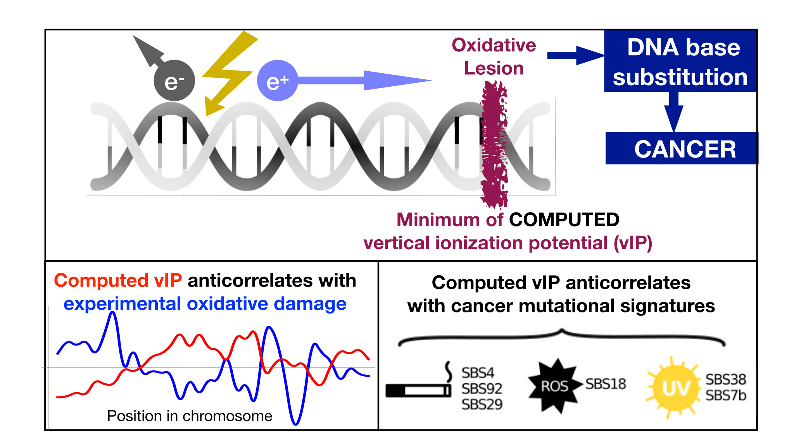

# MutationvIP



This repository contains the code to generate the figures and results from the paper [Linking somatic mutations in cancer to the electronic properties of DNA](https://www.biorxiv.org/content/10.64898/2026.01.02.697387v1)

The paper investigates whether the electronic properties of DNA — quantified by the vertical Ionization Potential (vIP) score, a quantum-chemistry-derived measure of the ionization energy of each nucleotide k-mer — predict where somatic mutations preferentially accumulate in the human genome. A lower vIP indicates a more electron-rich (more oxidizable) context; we show that high-vIP contexts systematically accumulate fewer mutations across a broad range of mutation types and databases.

All genomic coordinates use the GRCh38/hg38 assembly.

## Get Started 🚀
Install dependencies using one of the following methods:

### Using venv
```bash
python -m venv venv 
source venv/bin/activate
pip install -r requirements.txt
```
### Using UV
```bash
uv sync
source .venv/bin/activate
```

When the requirements are installed you are ready to run the different notebooks.


## File Acquision
The first line of each notebook explains where you can obtain the necessary file to run the notebook.


